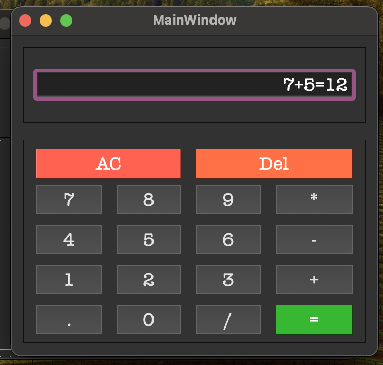
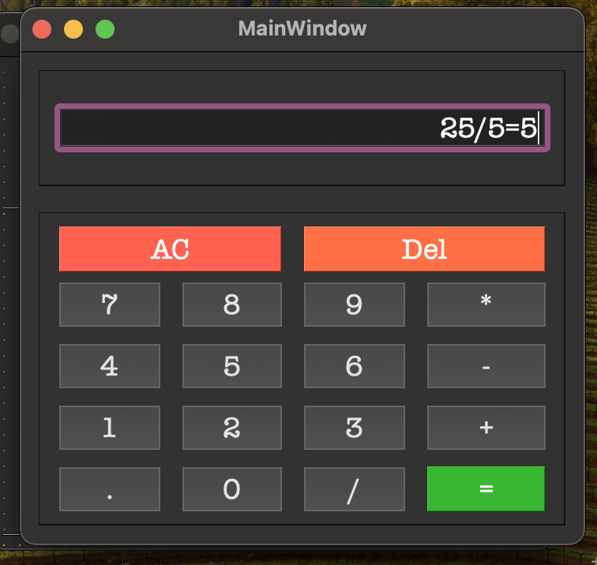
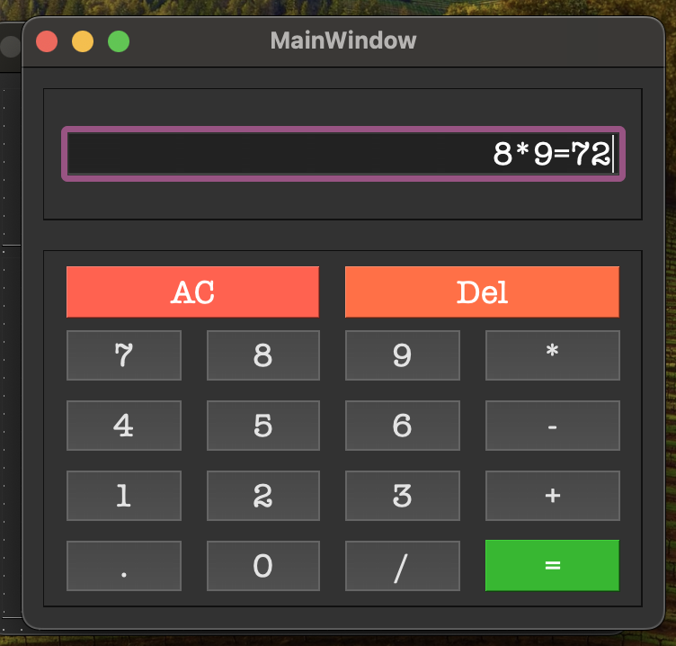
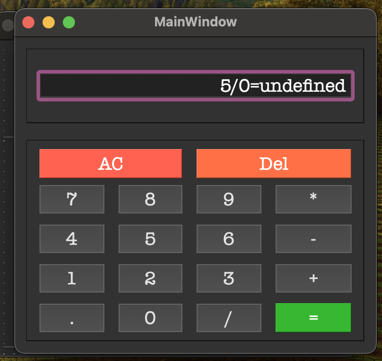

# Simple Calculator

This is a simple calculator application built using PyQt6. The application supports basic arithmetic operations such as addition, subtraction, multiplication, and division.

## Classes and Methods

### `Calculator` Class
- **Purpose**: This class represents the main window of the calculator application.
- **Methods**:
  - `__init__(self)`: Initializes the calculator window and sets up the UI.
  - `initUI(self)`: Connects the buttons to their respective functions.
  - `append_number(self, number)`: Appends a number to the display.
  - `append_operator(self, operator)`: Appends an operator to the display.
  - `calculate_result(self)`: Evaluates the expression and displays the result.
  - `clear_display(self)`: Clears the display.
  - `change_sign(self)`: Changes the sign of the current number.
  - `delete_number(self)`: Deletes the last character from the display.

## How to Run

1. Ensure you have Python and PyQt6 installed. You can install PyQt6 using pip:
   ```sh
   pip install PyQt6
    ```
2. Run the `main.py` file:
    ```sh
   python main.py
    ```

## Sample Input/Output
### Example 1
**Input**: 7 + 5 = **Output**: 12



### Example 2
**Input**: 25 / 5 = **Output**: 5



### Example 3
**Input**: 8 * 9 = **Output**: 72



### Example 4
**Input**: 5 / 0 = **Output**: undefined


